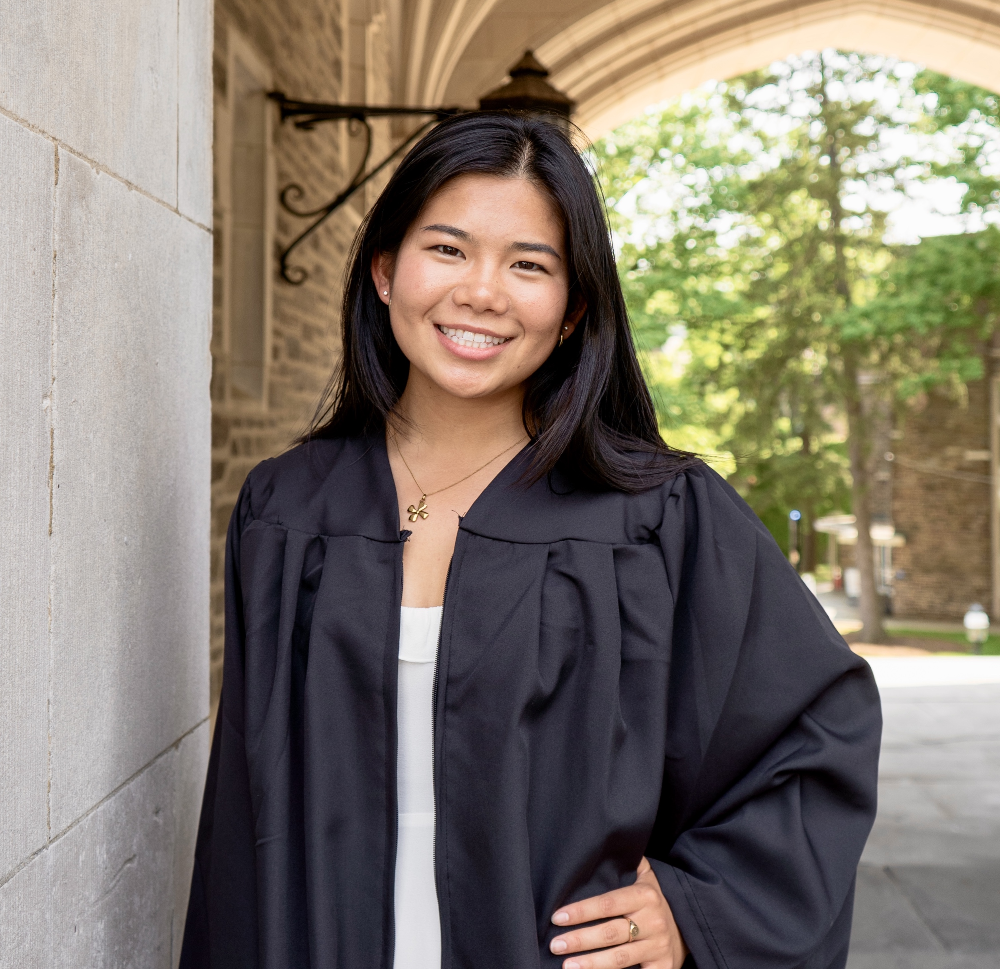

 

 I am a first year PhD student at NYU working with <a href="https://todd.gureckislab.org/" target="_blank">Todd Gureckis</a> in the <a href="https://gureckislab.org/" target="_blank">Computation and Cognition Lab</a>. My current focus is on language in RL. 

I am interested in intelligence! Of both humans and machines. My research applies computer science to human cognition, and I hope insights into human thinking and learning will inform the development of sustainable AI systems. 

Previously at Princeton, I studied Computer Science with certificates in Applied Math and Cognitive Science. My senior thesis was advised by <a href="https://cocosci.princeton.edu/tom/index.php" target="_blank">Tom Griffiths</a> and explored how iterated learning can reveal the inductive biases of CNNs. 

---
 [[thoughts/]] 
My [curriculum vitae](Attachments/CV)
<a href=Attachments/CV.pdf target="_blank"> curriculum vitae </a>

Here are my [[thoughts/]].

Here is my [[Spring2024CV]]

Here are my papers. 

Talk to me about <a href="https://strava.app.link/wUsXaJj1cIb" target="_blank">running</a> or <a href="https://www.goodreads.com/user/show/163690984-ellen-su" target="_blank">reading</a>!