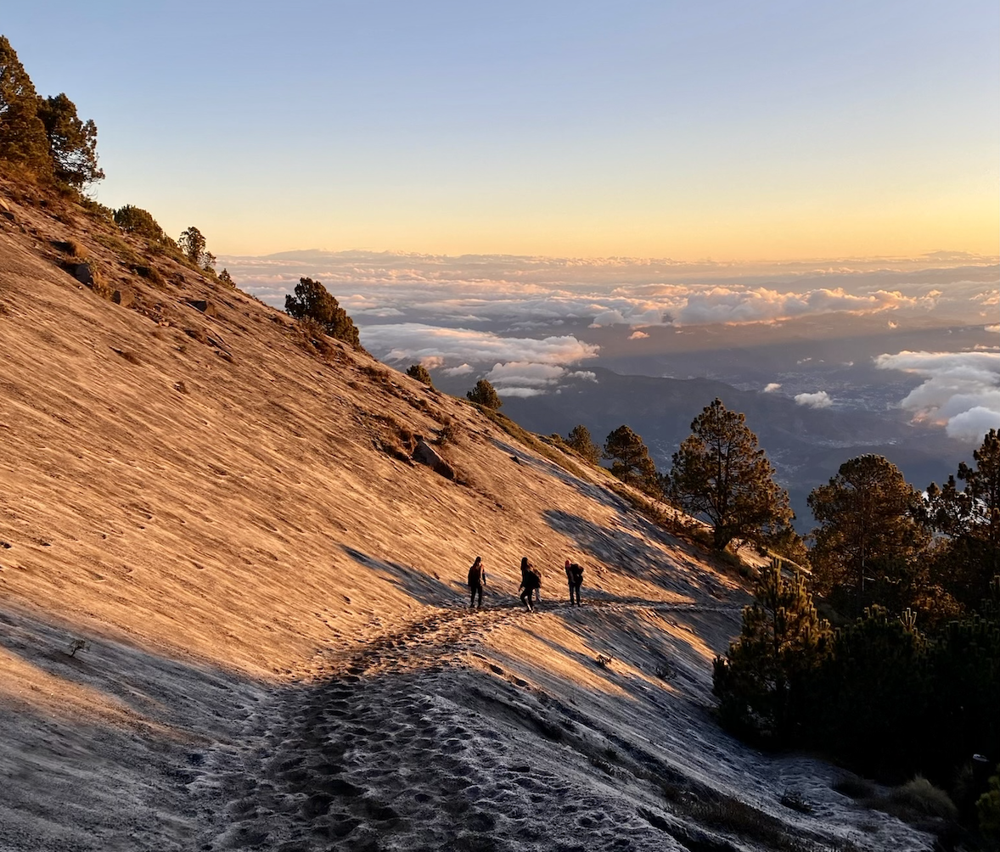

 
 I am a first year PhD student at NYU working with <a href="https://todd.gureckislab.org/" target="_blank">Todd Gureckis</a> in the <a href="https://gureckislab.org/" target="_blank">Computation and Cognition Lab</a>. I study language and decision making in humans and machines. Currently, I am working on building a computational model of multi-turn intent detection 

I am interested in intelligence! Of both humans and machines. My research targets machine learning and human cognition, and I hope insights into human communication and decision-making will inform the future development of sustainable AI systems. 

Previously at Princeton, I completed my Bachelor of Science in Computer Science with certificates in Applied Math and Cognitive Science. My senior thesis was advised by <a href="https://cocosci.princeton.edu/tom/index.php" target="_blank">Tom Griffiths</a> and used iterated learning to reveal the inductive biases of CNNs and to probe the effects of sequential training on synthetic data. Following, I continued my research in the <a href="https://carpenter-singh-lab.broadinstitute.org/" target="_blank">Carpenter-Singh lab </a> at the Broad Institute of MIT and Harvard, applying graph neural networks to identify drug targets. I have also dabbled in AI security and language model red teaming research. 

---
</figure>

Enjoy these photos from my favorite sunrise hikes as you browse through:

&emsp; - my [[Publications]],

%% &emsp; - my [[Thoughts]],%%

&emsp; - and my [[CV]]. 

---
Lastly, talk to me about <a href="https://strava.app.link/wUsXaJj1cIb" target="_blank">running</a> or <a href="https://www.goodreads.com/user/show/163690984-ellen-su" target="_blank">reading</a>!