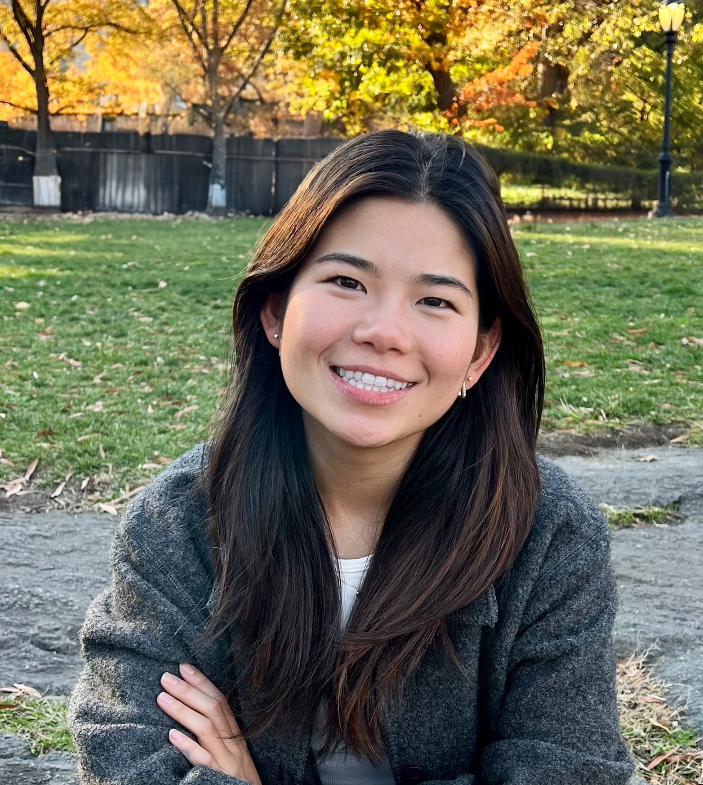
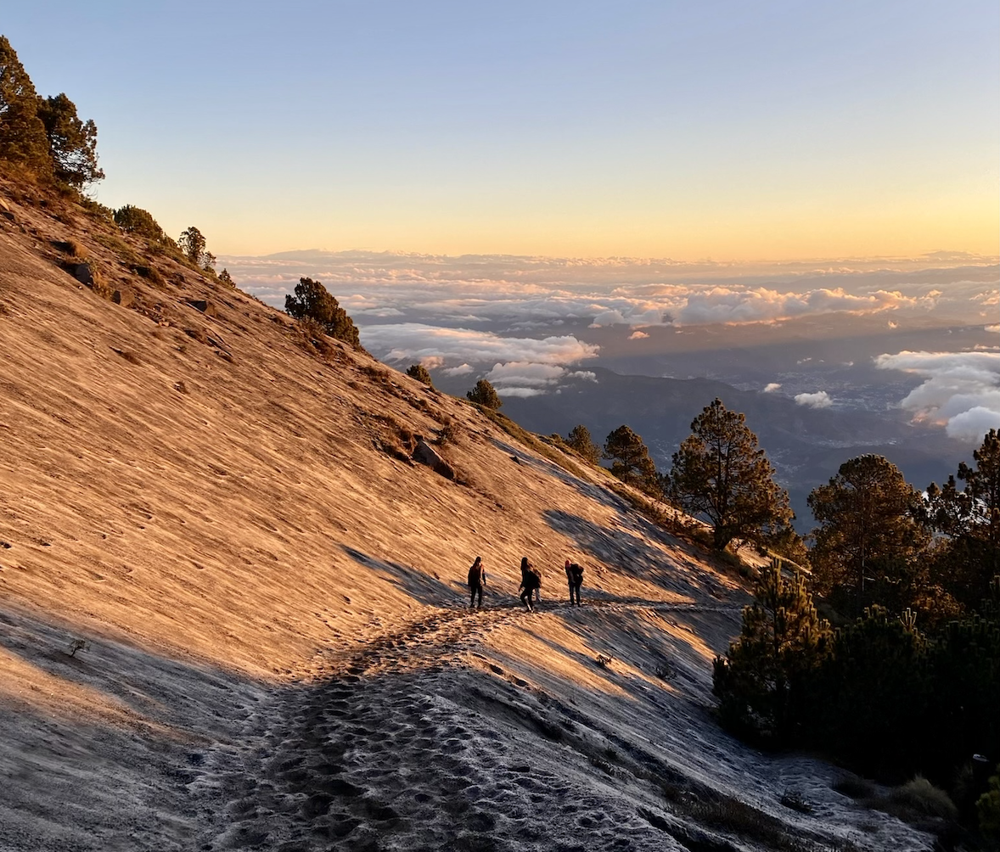

<!-- Google tag (gtag.js) -->  
 
 I am a first year PhD student at NYU working with <a href="https://todd.gureckislab.org/" target="_blank">Todd Gureckis</a> in the <a href="https://gureckislab.org/" target="_blank">Computation and Cognition Lab</a>. I study human and machine intelligence applied to language processing and decision making. 

Previously at Princeton, I completed my Bachelor of Science in Computer Science with certificates in Applied Math and Cognitive Science. My senior thesis was advised by <a href="https://cocosci.princeton.edu/tom/index.php" target="_blank">Tom Griffiths</a> and used iterated learning to probe the inductive biases of CNNs. Following, I continued my research in the <a href="https://carpenter-singh-lab.broadinstitute.org/" target="_blank">Carpenter-Singh lab </a> at the Broad Institute of MIT and Harvard, where I applied graph neural networks to identify drug targets. I have also worked on AI security and LM red teaming research. 

Key interests: machine learning, cognitive science, AI

---
</figure>

Enjoy these photos from my favorite sunrise hikes as you browse through:

&emsp; - my [[Publications]],

&emsp; - my [[Thoughts]],

&emsp; - and my [[CV]]. 

---
Lastly, talk to me about <a href="https://strava.app.link/wUsXaJj1cIb" target="_blank">running</a> or <a href="https://www.goodreads.com/user/show/163690984-ellen-su" target="_blank">reading</a>!