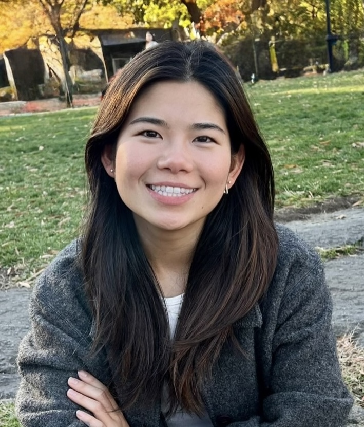
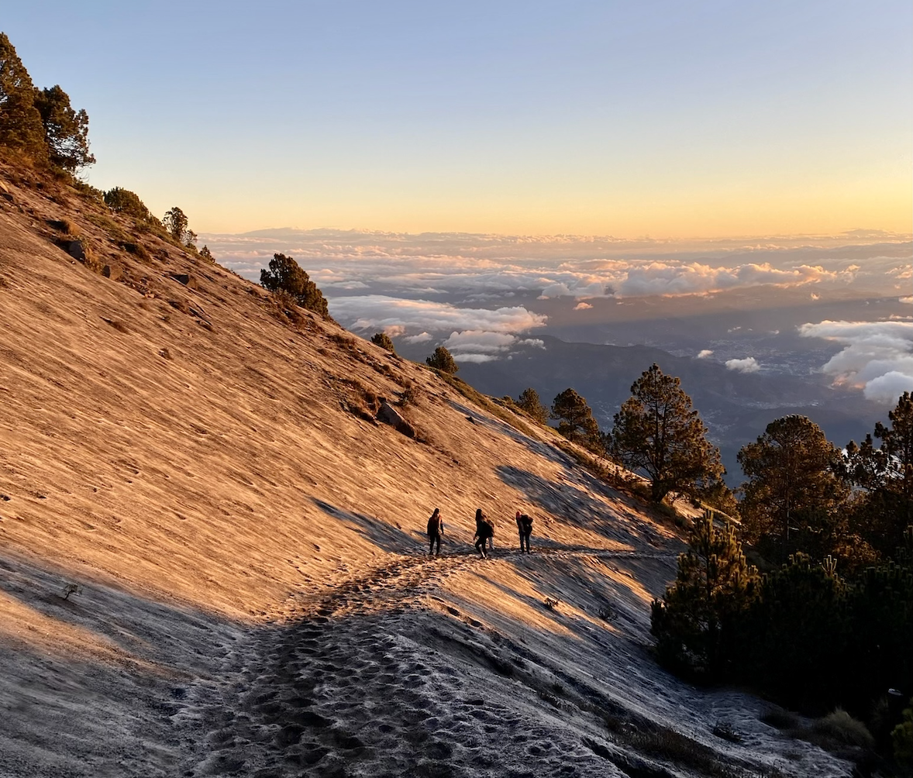

<!-- Google tag (gtag.js) -->  

 I am a third year PhD student in the NYU <a href="https://cds.nyu.edu/" target="_blank">Center for Data Science</a>. I am grateful to be advised by <a href="https://todd.gureckislab.org/" target="_blank">Todd Gureckis</a> in the <a href="https://gureckislab.org/" target="_blank">Computation and Cognition Lab</a>. I am also a Visiting Researcher at Meta FAIR, under the mentorship of <a href="https://ai.meta.com/people/7521230338002823/florian-bordes/" target="_blank">Florian Bordes</a> and <a href="https://ai.meta.com/people/1396973444287406/adina-williams/" target="_blank">Adina Williams</a>, and I am fortunate to be supported by Meta's AI Mentorship (AIM) program. Broadly, I study the intersection of machine learning and cognitive science and am particularly interested in the representations in humans and artificial intelligence systems which enable efficient language learning, visual reasoning, and decision making. Currently, I am focused on advancing physical reasoning in video world models.

Previously at Princeton, I completed my Bachelor of Science in Computer Science with certificates in Applied Math and Cognitive Science. My senior thesis was advised by <a href="https://cocosci.princeton.edu/tom/index.php" target="_blank">Tom Griffiths</a> and applied iterated learning to probe the inductive biases of CNNs. Following, I continued my research in the <a href="https://carpenter-singh-lab.broadinstitute.org/" target="_blank">Carpenter-Singh Lab </a> at the <a href="https://www.broadinstitute.org/" target="_blank">Broad Institute of MIT and Harvard </a>, where I applied graph neural networks to the problem of drug target matching.

Key interests: machine learning, cognitive science, AI

## Updates

  

  

    
Sep 2026

    
Started as a Visiting Researcher at Meta FAIR, supported by Meta's AI Mentorship (AIM) program. 

  

  

    
Sep 2026

    
<em>Epiplexity Guided Data Selection and Generation for Out-of-Distribution Generalization</em> was accepted to <strong>NeurIPS 2026</strong>!

  

  

    
Aug 2026

    
 I will be at MBL Woods Hole for the month to attend the <a href="https://cbmm.mit.edu/summer-school" target="_blank">Brains, Minds and Machines</a> summer program.

  

  

    
Aug 2026

    
New preprint on <a href="https://doi.org/10.48550/arXiv.2608.11746" target="_blank">arXiv</a>: epiplexity-guided data selection for OOD generalization.

  

  

    
Aug 2026

    
We are presenting <em>Timing of Guidance Shapes Experiential Learning</em> at <strong>CCN 2026</strong>.

  

  

    
Dec 2025

    
Excited to announce that we will be presenting <em>Learning Intuitive Physics Requires More Than Visual Data</em> at the <strong>NeurIPS</strong> Embodied World Models for Decision Making workshop!

  

  

    
June 2025

    
Happy to announce that <em>Integration of Language and Experience via the Instructed Bandit Task</em> was accepted for <strong>CogSci 2025</strong>.

  

  

    
Sep 2024

    
<em>MOTIVE: A Drug-Target Interaction Graph for Inductive Link Prediction</em> was just selected as a spotlight paper at <strong>NeurIPS</strong> Datasets &amp; Benchmarks.

  

  

    
Sep 2024

    
Started my PhD at the <a href="https://cds.nyu.edu/" target="_blank">NYU Center for Data Science</a>!

  

  

---

</figure>

Enjoy photos from my favorite sunrise hikes as you browse through:

&emsp; - my [[Publications]],

&emsp; - my [[Thoughts]],

&emsp; - and my <a href="/currCV.pdf" target="_blank" rel="noopener noreferrer">CV</a>.

---

Lastly, talk to me about <a href="https://strava.app.link/wUsXaJj1cIb" target="_blank">running</a> or <a href="https://www.goodreads.com/user/show/163690984-ellen-su" target="_blank">reading</a>!
